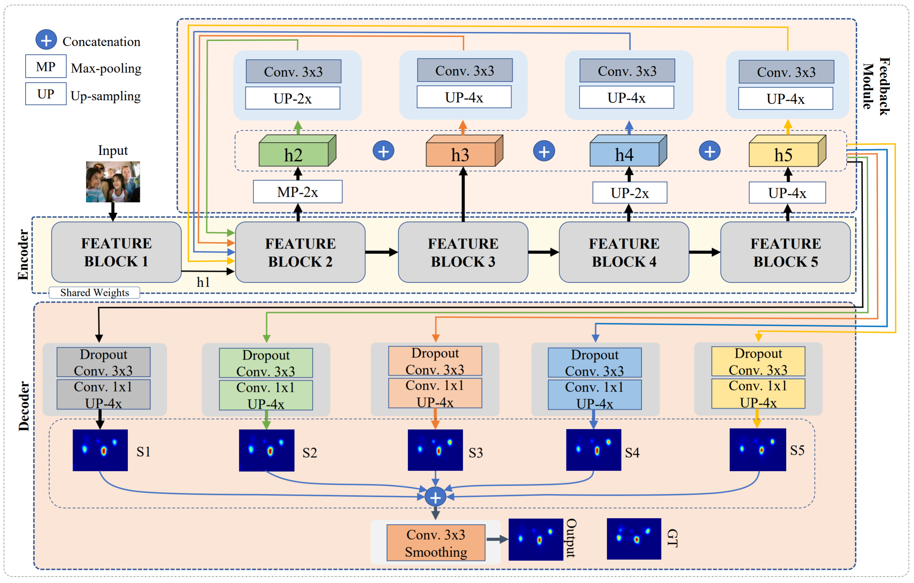
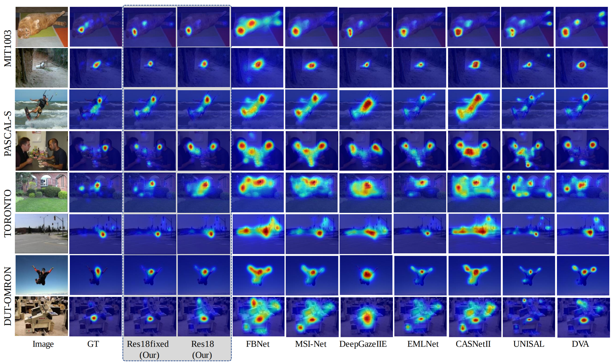
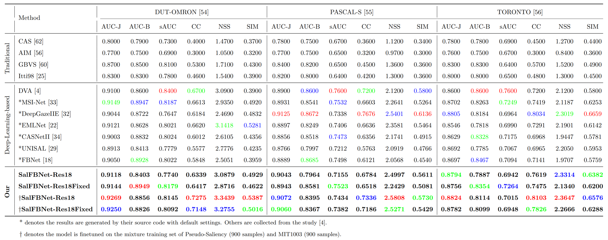
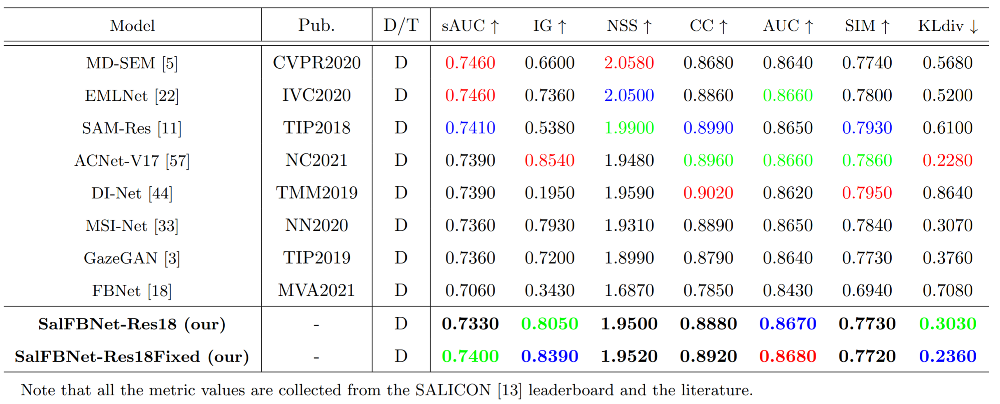
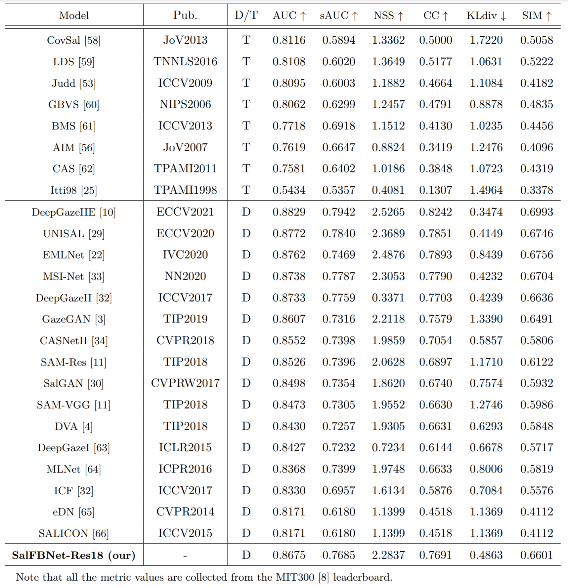
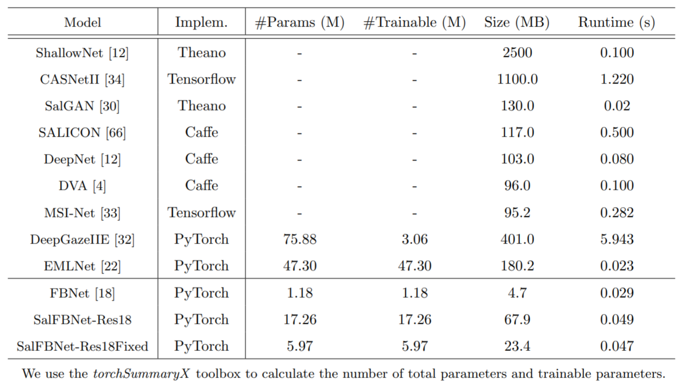

# SalFBNet

SalFBNet: Learning Pseudo-Saliency Distribution via Feedback Convolutional Networks, 2021

Guanqun Ding, Nevrez Imamoglu, Ali Caglayan, Masahiro Murakawa, Ryosuke Nakamura



## Getting Started
### 1. Installation
```
conda create -n salfbnet python=3.8
conda activate salfbnet
conda install pytorch torchvision cudatoolkit=11.3 -c pytorch
pip install scikit-learn scipy tensorboard tqdm
pip install torchSummeryX
```
### 2. Run
The running code will be released after our paper is published.

### 3. Datasets

Dataset | #Image | #Training | #Val. | #Testing | Size | URL | Paper
:-------:|:-------:|:-------:|:-------:|:-------:|:-------:|:-------:|:-------:|
SALICON | 20,000 | 10,000 | 5,000 | 5,000 | ~4GB | [download link](http://salicon.net/challenge-2017/) | [paper](http://www-users.cs.umn.edu/~qzhao/publications/pdf/salicon_cvpr15.pdf)
MIT300 | 300 | - | - | 300 | ~44.4MB | [download link](http://saliency.mit.edu/results_mit300.html) | [paper](https://dspace.mit.edu/handle/1721.1/68590)  
MIT1003 | 1003 | 900* | 103* | - | ~178.7MB | [download link](http://people.csail.mit.edu/tjudd/WherePeopleLook/) | [paper](http://people.csail.mit.edu/tjudd/WherePeopleLook/Docs/wherepeoplelook.pdf)
PASCAL-S | 850 | - | - | 850 | ~108.3MB | [download link](http://cbs.ic.gatech.edu/salobj/) | [paper](https://arxiv.org/pdf/1406.2807)
DUT-OMRON | 5,168 | - | - | 5,168 | ~151.8MB | [download link](http://saliencydetection.net/dut-omron/) | [paper](http://saliencydetection.net/dut-omron/download/manifold.pdf)
TORONTO | 120 | - | - | 120 | ~92.3MB | [download link](http://www-sop.inria.fr/members/Neil.Bruce/) | [paper](http://www-sop.inria.fr/members/Neil.Bruce/NIPS2005_0081.pdf)
Pseudo-Saliency (Ours) | 176,880 | 150,000 | 26,880 | - | ~24.2GB | [download link] | [paper]

* \*Training and Validation sets are randomly split by this work.
* We will release our Pseudo-Saliency dataset after our paper is published.

### 4. Downloads
- Our pre-trained models

    It will be available soon.
    
    1. Downloading all zipped files, and using following command to restore the complete zip file:
    ```
    zip -F PseudoSaliency_avg_dataset.zip --out PseudoSaliency_avg.zip
    ```
    2. Then unzip the file:
    ```
    unzip PseudoSaliency_avg.zip
    ```
        
- Our testing saliency results on public datasets

    You can download our testing saliency resutls from this [link].

## Performance Evaluation

### 1. Visulization Results


### 2. Testing Performance on DUT-OMRON, PASCAL-S, and TORONTO


### 3. Testing Performance on SALICON


### 4. Testing Performance on MIT300


### 5. Efficiency Comparison


## Acknowledgement
- Data Collection

    We collect color images from [ImageNet](https://image-net.org/download.php) and SOD datasets including [CSSD](https://www.cse.cuhk.edu.hk/leojia/projects/hsaliency/dataset.html), [ECSSD](https://www.cse.cuhk.edu.hk/leojia/projects/hsaliency/dataset.html), [HKU-IS](https://i.cs.hku.hk/~gbli/deep_saliency.html), [MSRA-B](https://mmcheng.net/msra10k/), [MSRA10K](https://mmcheng.net/msra10k/), [THUR15K](https://mmcheng.net/gsal/). 

- Pseudo-Annotators

    We use 5 models as our Pseudo-Annotators, including [DeepGazeIIE](https://github.com/matthias-k/DeepGaze), [UNISAL](https://github.com/rdroste/unisal), [MSINet](https://github.com/alexanderkroner/saliency), [EMLNet](https://github.com/SenJia/EML-NET-Saliency), [CASNetII](https://ncript.comp.nus.edu.sg/site/ncript-top/emotionalattention/).

    We appriciate their public datasets and codes.


